# Azure Networking Lab

## Prerequisites

- Microsoft Azure subscription
- Resource Group to deploy Azure services
- Permissions to create VMs with public IP addresses


## Step 1: Deploy the first Virtual Network

Before following the steps below, make sure you have created a resource group where you will be deploying all the resources for this lab. The first resource we'll be depoying is ata-vnet1.

1. In the Azure Portal, search for **Virtual Networks**
2. Click on the **Create** button
3. Fill out the **Basics** tab as follows:
- **Subscription:** Choose your subscription
- **Resource Group:** Select the Resource Group you created for this lab.
- **Name:** Choose a unique name. Ex: ata-vnet1
- **Region:** East US

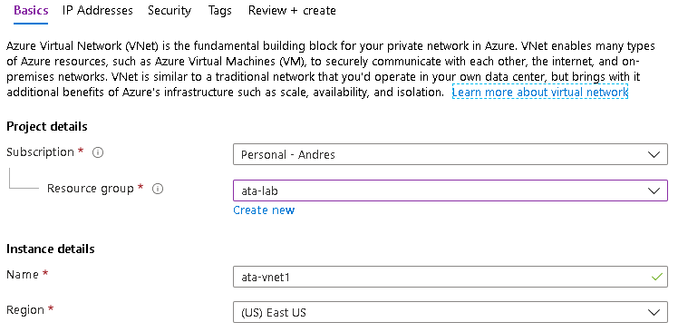


4. Click the **Next: IP Addresses** button
5. Inside the **IP Addresses** tab fill out as follows:
- **IPv4 address space:** Choose a private IP address space to use for this network. Ex: 10.0.0.0/16
- Leave everything else as default

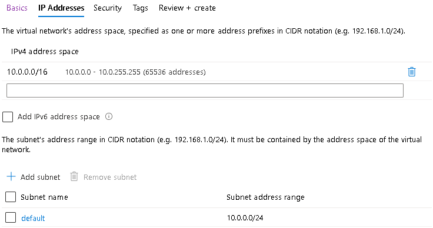

6. 4. Click the **Next: Security** button
7. Leave everything as default in the **Security** tab and click the **Next: Tags** button
8. Enter any custom tags (optional) and click the **Next:Review + Create** button
9. Click **Create** and wait a couple of minutes for this virtual network to be created.

## Step 2: Deploy the second Virtual Network

Go through the same steps you just followed earlier and deploy ata-vnet2. Use the following parameters instead:

- **Name:** Enter a different name for this Vnet. Ex: ata-vnet2
- **IPv4 address space**: Choose a private IP address space different than what was used for ata-vnet1. Ex: 10.1.0.0/16

**IMPORTANT**: Make sure the two address spaces for ata-vnet1 and ata-vnet 2 DO NOT overlap. You will not be able to complete this lab if they do. Use the recommended address spaces listed above.

## Step 3: Deploy the first VM

1. In the Azure Portal, search for **Virtual Machines**
2. Click on the **Add** button
3. Fill out the **Basics** tab as follows:
- **Subscription:** Choose your subscription
- **Resource Group:** Select the Resource Group you created for this lab.
- **Virtual Machine Name:** Choose a unique name for the VM. Ex: ata-vm1
- **Region:** East US
- **Availability Options:** No infrastructure redundancy required
- **Image:** Ubuntu Server 18.04 LTS
- **Azure Spot Instance:** No
- **Size:** Standard D2s v3
- **Authentication Type:** Password
- **Username:** Enter your user name. Ex: ata-user
- **Password:** Enter your password
- **Select inbound ports:** SSH(22)

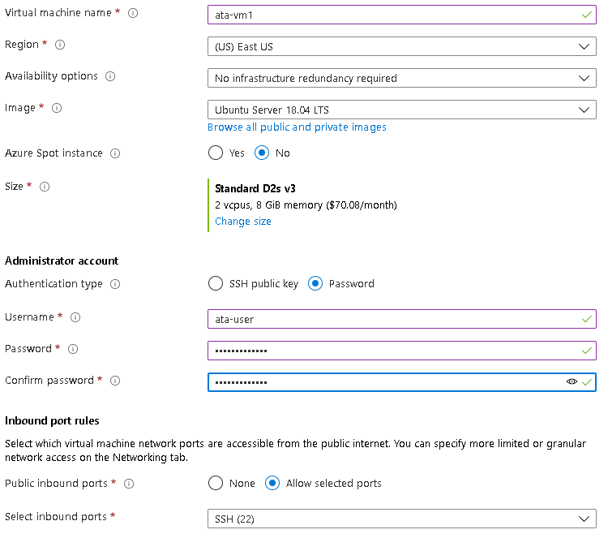

4. Click the **Next: Disks** button
5. Leave everything as default and click the **Next: Networking** button
6. Fill out **Networking** tab as follows:

- **Virtual Network:** Select the first virtual network you created earlier. Ex: ata-vnet1
- **Public IP:** None
- Leave everything else as default

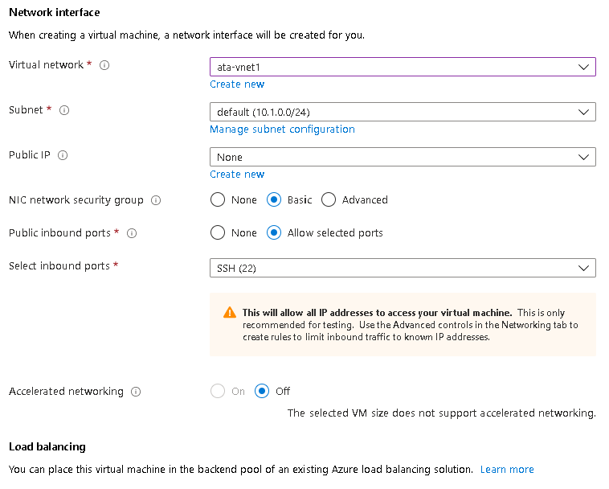

7. Click the **Next: Management** button
8. Inside the **Management** tab:
- Turn off **Boot diagnostics** and **Auto-Shutdown**
- Leave everything else as default

9. Click the **Next: Advanced** button
10. Leave everything as default and click on the **Next: Tags** button
11. Enter any custom tags (optional) and click the **Next: Review + Create** button
12. Click the **Create** button

## Step 4: Deploy the second VM

While the first VM is being deployed, you can follow the same steps you just completed to deploy the second VM. Use the following parameters for the second VM:

1. Inside the **Basics** tab:
- **Name:** Enter a different name for this VM. Ex: ata-vm2
- **Image:** Windows Server 2019 Datacenter

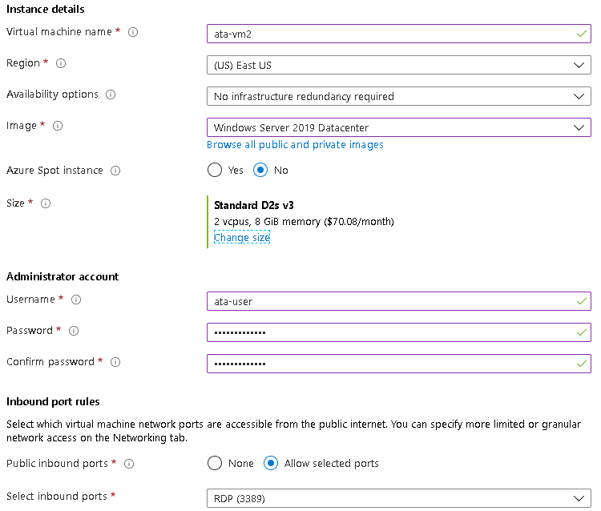

2. Inside the **Networking** tab:
- **Virtual Network:** Select the second VNet you deploy. Ex: ata-vnet2
- **Public IP**: Leave default to create a new public IP

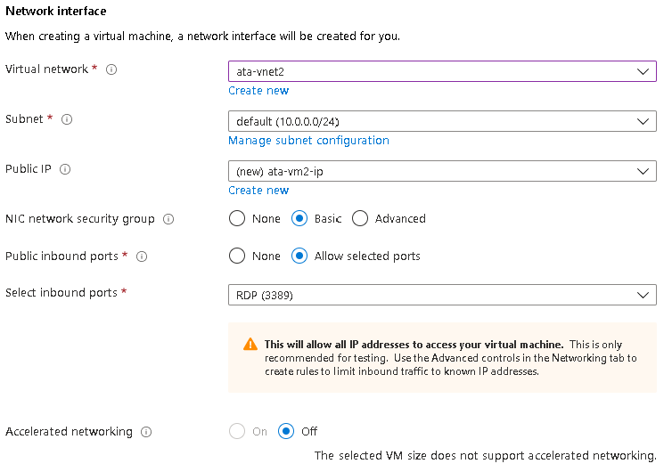

3. For all the other tabs just follow the same configuration as ata-vm1

## Step 5: Review VM configuration and test connectivity

Once the two VMs are deployed, follow these steps to review their configuration and test connectivity between the two VMs:

1. Go to your resource group and open the first VM (ata-vm1)
2. On the top right of the **Overview** page and take note of **Private IP address** assigned to the VM. You will notice that the IP comes from the address range that was defined for ata-vnet1. The **Public IP Address** field should be empty - therefore this VM cannot be accessed from the internet.
3. On the left blade, click on **Networking**. Here you will see other network configuration for the VM including the ports that are allowed. For this VM you should see Port 22 allowed.


4. Open your second VM (ata-vm2)
5. On top right of the **Overview** page, and take note of the two IP addresses that were assigned to this VM - a **Private IP address** and a **Public IP address**. Since this VM has a public IP, it is accessible from the internet.
6. On the left blade, click on **Networking** and confirm that port 3389 is open for this VM.


## Step 6: Connect to VM2

1. Copy the public IP address you found in the **Overview** page
2. Open Remote Desktop Connection application, paste the IP address and click on **Connect**
3. Once you are inside VM2, open a Command Prompt window and execute the following commands:

    ```
    ping <VM1_IP_Address>
    ```
    ```
    ssh ata-user@<VM1_IP_Address>
    ```

4. Both of those commands should fail since these two VMs are in two different networks and there is no connectivity between those networks.

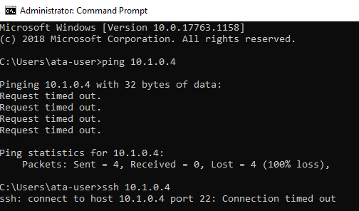


## Step 7: Create a Virtual Network Peering between Vnet1 and Vnet2

1. Go back to your resource group and open the first Vnet you created (ata-vnet1)
2. On the left blade select **Peerings** and click **+ Add**
3. Fill out the form with the following information:
4. Within **This virtual network** configure the following setting:  

- **Peering link name:** Enter a unique name for this peering(Ex: vnet1-to-vnet2-peering)  
- Leave everything else as default  

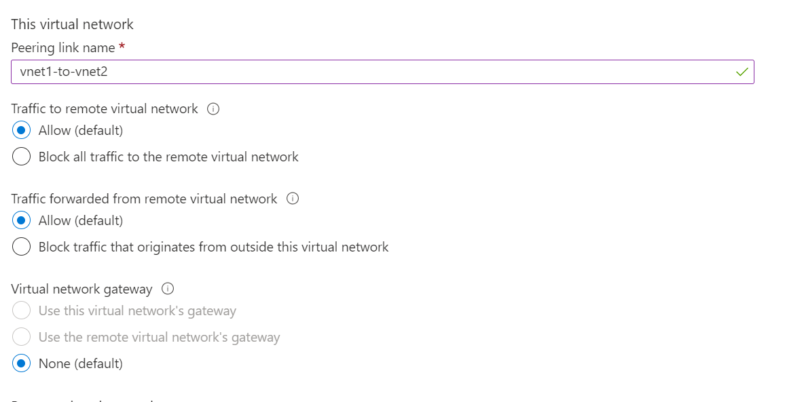

5. Within ‘Remote virtual network’ configure the following settings:  

- **Peering link name:** Enter a unique name for this peering(Ex: vnet2-to-vnet1-peering)  
- **Virtual Network deployment model:** Resource Manager  
- **Subscription:** Select your subscription  
- **Virtual Network:** Select your second Virtual Network (ata-vnet2)  
- Leave everything else as default and click Add  

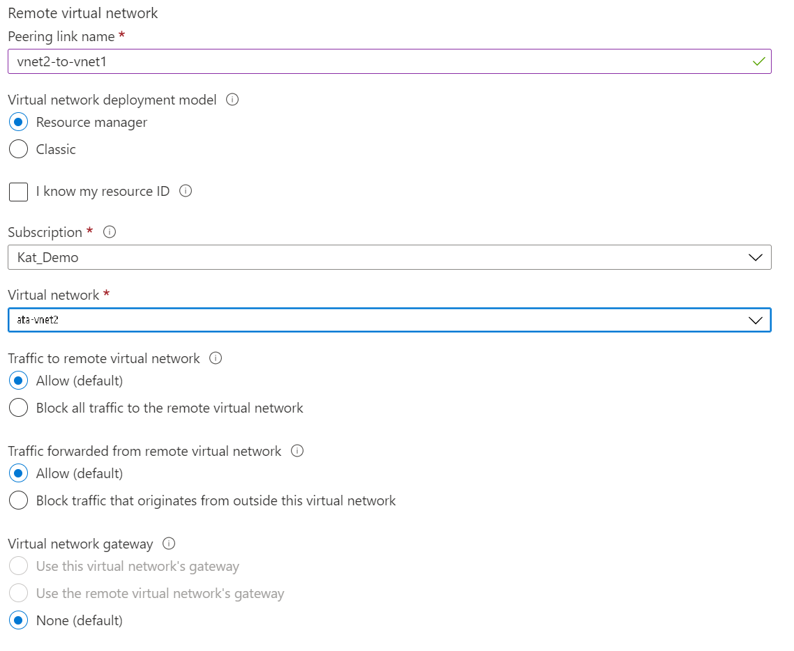

6. After this is completed, the two VNets should be peered and VMs on one VNet should be able to reach VMs on the other VNet.
7. Repeat **Step 7** and confirm that the ata-vm-2 is now able to ping and SSH into ata-vm-1

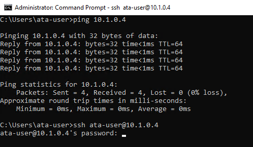

## Step 8: Create Storage Account and test connectivity

1. In the Azure Portal, search for **Storage Accounts**
2. Click the **+Create** button
3. Fill out the **Basics** tab as follows:
- **Subscription:** Select your subscription
- **Resource Group:** Select the resource group you created for this lab
- **Storage account name:** Enter a globally unique name (ex:ataaustorage1234)
- **Location:** East US
- **Performance:** Standard
- **Account Kind:** StorageV2 (general purpose V2)
- **Replication:** Localy-redundant storage (LRS)
- **Access tier:** Hot

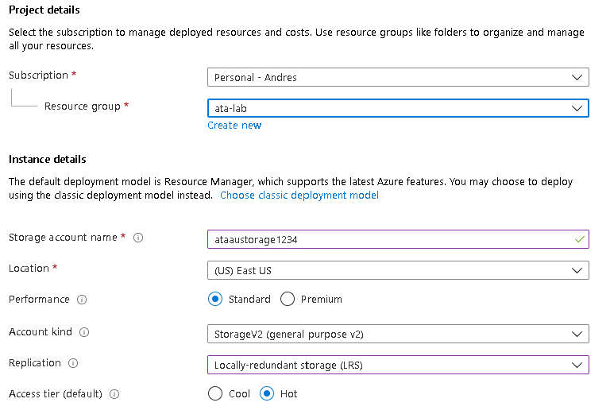

4. Click on **Next: Networking**
5. In the **Networking** tab, make sure that **Public endpoint (all networks) is selected as the Connectivity Method
6. Leave everything as default and click on **Next: Data Protection**
7. Leave everything as default and click on **Next: Advanced**
8. Leave everything as default and click on **Next: Tags**
9. Enter any custom tags (optional) and click on **Review + create**
10. Click the **Create** button
11. Open the new Storage Account once it finishes deploying
12. In the **Overview** page click on **Containers**
13. Click the **+ Container** and enter the name of the new container (Ex: ata-container). For the **Public access level** dropdown select "Container (anonymous read access for container and blobs).
14. Click **Create**


14. Click on the new container and then select **Upload** to upload any picture you want.
15. Click on the new file uploaded and copy the URL field for the file

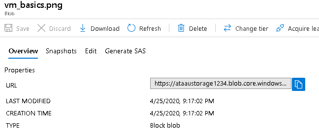

16. Paste that URL into your local browser and VM2's browser. The link should work and you should see the picture you just uploaded. The reason why it works is because you are allowing any network to connect to the Storage Account.

## Step 9: Create Service Endpoint and restrict connectivity

1. Back to the Storage Account, click on **Networking** on the left blade
2. Select **Selected Networks**
3. Click on **+Add existing virtual network** button
4. On the menu that opens, select the Virtual Network and Subnet where VM2 was deployed (Ex:ata-vnet2/default). Click **Enable**
5. It will take a couple of seconds for the [Service Endpoint](https://docs.microsoft.com/en-us/azure/virtual-network/virtual-network-service-endpoints-overview) 
 to be enabled for the selected VNet/Subnet
 6. Once the Service Endpoint has been enabled, click on **Add**
 7. Click on the **Save** button

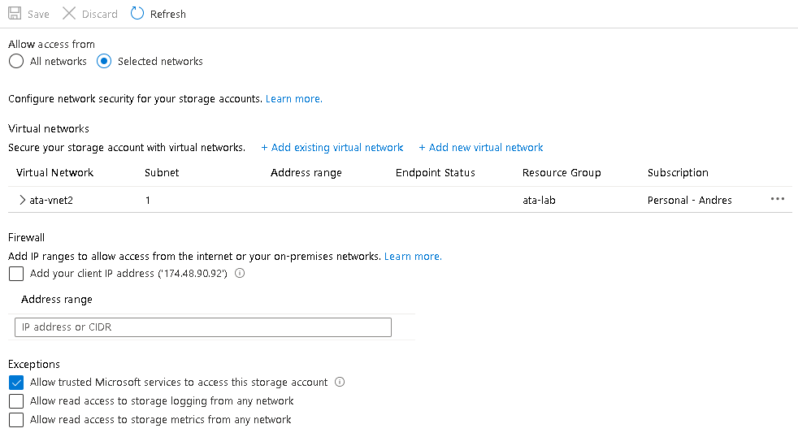
 
 8. Attempt to open the image again from your local computer and from VM2. It should fail from your local computer but succeed from VM2 because the Storage Account is only allowing connections from ata-vnet2/default subnet where ata-vm2 is deployed.
